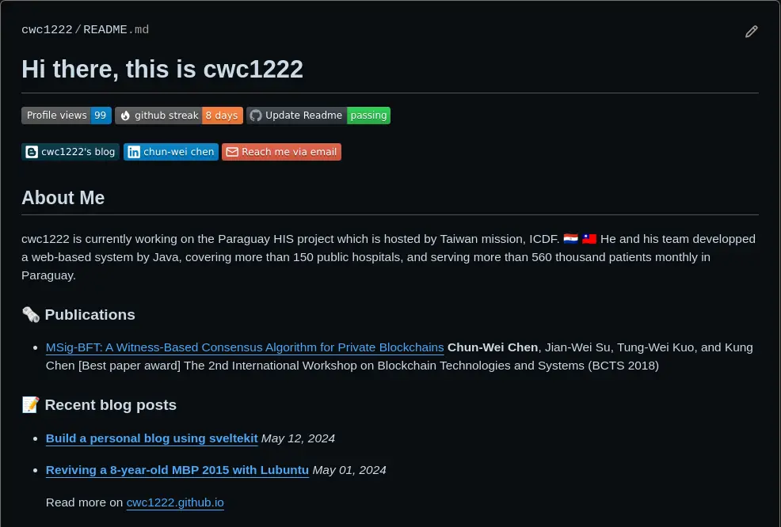
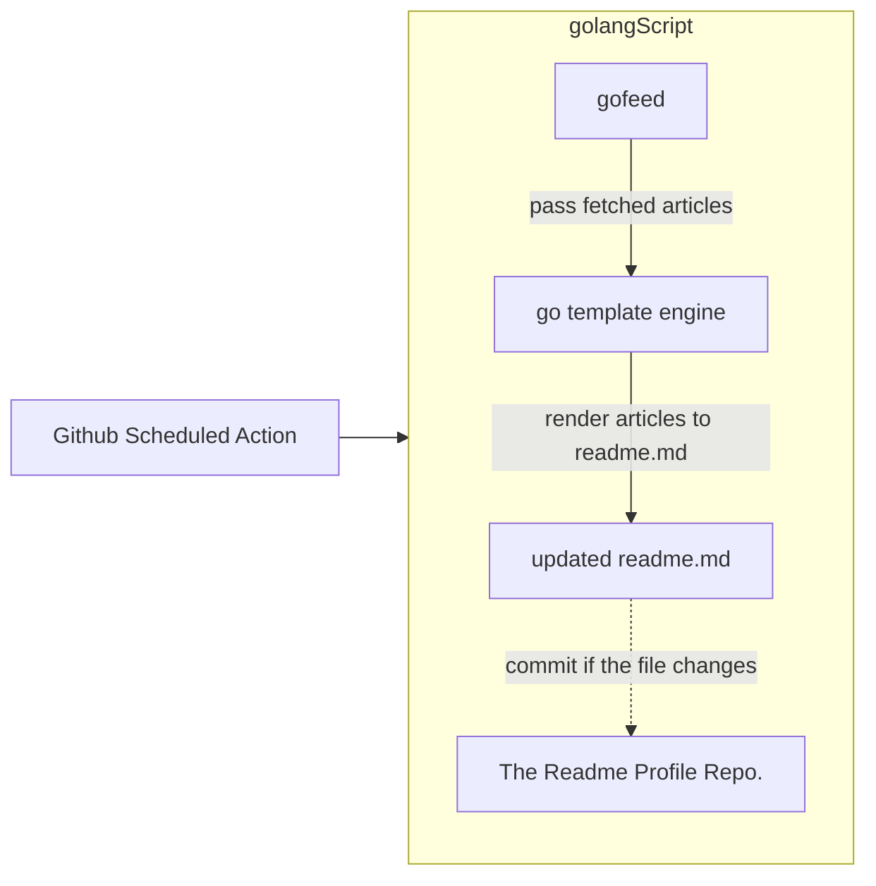
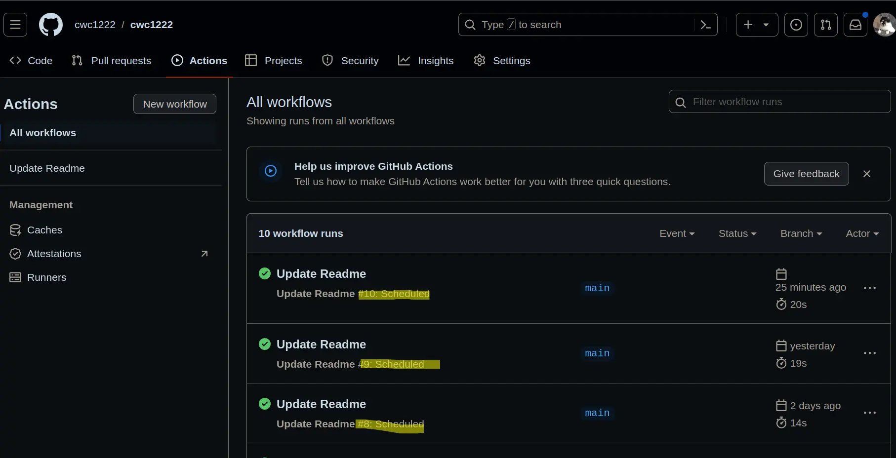

# Make your github profile README self updated

## Goal

The [github profile readme](https://docs.github.com/en/account-and-profile/setting-up-and-managing-your-github-profile/customizing-your-profile/about-your-profile) is not a new fancy thing around, however, one might find it painful updating personal news like latest blog posts or recent researches.

Hence the goal is clear, **for those who wanna make their github profile readme self-updated**, you could check out the implementation proposed in this article as a reference and perhaps make your own version.

Being more specific, the goal will be making the profile readme being like this, with the **Recent blog posts** section being updated when there is new article published on [this site](https://cwc1222.github.io)



## Plan

To accomplish the goal, there are few necessary components:

### 1. A way to apply changes to github automatically

The easiest solution I've seen so far is using the [github scheduled action](https://docs.github.com/en/actions/using-workflows/events-that-trigger-workflows#schedule), with which you can simply writting a unix crontab syntax to schedule the update.

e.g.,

```yaml
## Cron Syntax Ref: https://crontab.guru
on:
  schedule:
    - cron: '0 0 * * *' # Every day at 00:00
```

### 2. A way to get the latest articles from the blog

Since my blog have rss feed implemented, I can easilly use a any language with a RSS parser to fetch the latest changes.
In this post I did the script in [Golang](https://go.dev/) and [gofeed](https://github.com/mmcdole/gofeed), however, any other language like python, java, typescript are very easy to go too, just pick one of those with which you are more familiar.

```golang
func parseFeeds(rssFeed string) *gofeed.Feed {
	fp := gofeed.NewParser()
	feed, err := fp.ParseURL(rssFeed)
	if err != nil {
		log.Fatalf("error getting feed: %v", err)
		panic(err)
	}
	return feed
}
```

### 3. A way to update the README.md file using the latest articles fetched in the previous step

With any template engine, you can effortlessly format parsed RSS data into a README.md.tmpl

```golang
### :memo: Recent blog posts
{{ range . }}
- **[{{.Title}}]({{.Link}})** *{{.PublishedParsed.Format "Jan 02, 2006" }}*
{{ end }}
    Read more on [cwc1222.github.io](https://cwc1222.github.io/)
```

### Summary



## Implementation

Alright! let's dig into the actual implementation

### Github Action

```yaml
name: Update Readme

on:
  push:
  workflow_dispatch:
  schedule:
    - cron: '0 0 * * *' # Every day at 00:00

jobs:
  build:
    runs-on: ubuntu-latest
    steps:
      - name: Check out repo
        uses: actions/checkout@v4
      - name: Set up Go
        uses: actions/setup-go@v5
        with:
          go-version: '1.22.3'
      - name: Generate README.md
        run: |-
          go run main.go
          cat README.md
      - name: Commit and push if changed
        run: |-
          git diff
          git config --global user.email "readme-bot@cwc1222.com"
          git config --global user.name "README-bot"
          git add -A
          git commit -m "Updated content" || exit 0
          git push
```

### Golang script

```golang
package main

import (
	"html/template"
	"log"
	"os"

	"github.com/mmcdole/gofeed"
)

const (
	blogRssFeed    = "https://cwc1222.github.io/rss.xml"
	maxPostsToShow = 5

	readmeTmplPath = "README.md.tmpl"
	readmePath     = "README.md"
)

func parseFeeds(rssFeed string) *gofeed.Feed {
	fp := gofeed.NewParser()
	feed, err := fp.ParseURL(rssFeed)
	if err != nil {
		log.Fatalf("error getting feed: %v", err)
		panic(err)
	}
	return feed
}

func main() {
	feed := parseFeeds(blogRssFeed)

	tmpl, err := template.ParseFiles(readmeTmplPath)
	if err != nil {
		log.Fatalf("create file: %v", err)
		panic(err)
	}

	readme, err := os.Create(readmePath)
	if err != nil {
		log.Fatalf("create file: %v", err)
		panic(err)
	}
	defer readme.Close()

	n := min(maxPostsToShow, len(feed.Items))
	err = tmpl.Execute(readme, feed.Items[0:n])
	if err != nil {
		log.Fatalf("create file: %v", err)
		panic(err)
	}
}
```

## Conclusion

Well, that's all! after pushed the changes to your profile readme repository, i.e., github.com/{your_github_username}/{your_github_username}, you will see this few days later:



That's it for today, see ya in other shares.

## References

- [Dynamic Github profile with Bun and Typescript](https://tduyng.dev/blog/dynamic-github-profile-with-bun-typescript/)
- [How to Update a GitHub Profile README Automatically](https://eugeneyan.com/writing/how-to-update-github-profile-readme-automatically/)
- [Automatically display your latest posts on your GitHub Profile README](https://dev.to/bobbyiliev/automatically-display-your-latest-posts-on-your-github-profile-readme-119f)
- [crontab guru](https://crontab.guru/)
- [Github.com: Managing your profile README](https://docs.github.com/en/account-and-profile/setting-up-and-managing-your-github-profile/customizing-your-profile/managing-your-profile-readme)
- [Awesome GitHub Profile README](https://github.com/abhisheknaiidu/awesome-github-profile-readme) -[devicon](https://github.com/devicons/devicon) -[Custom Icon Badges](https://github.com/DenverCoder1/custom-icon-badges)
